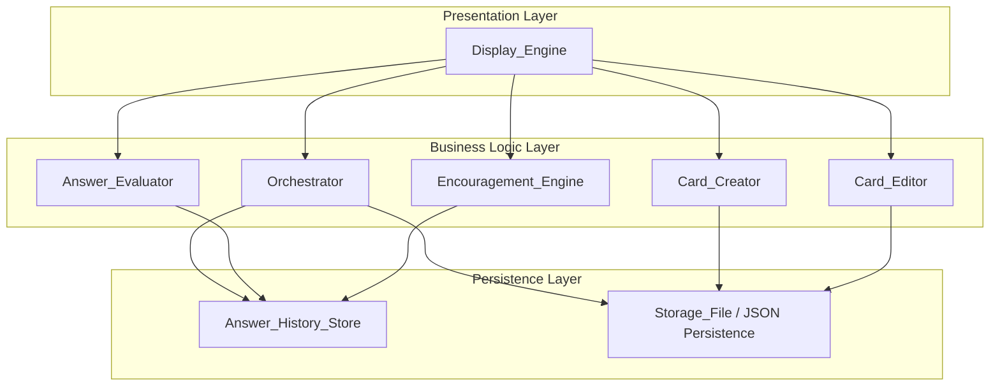

# Design Document: Flashcard App

## Overview

This document describes the technical design for a flashcard learning application that maximizes learning efficiency through spaced repetition and intelligent card orchestration. The application starts as a local macOS app with a progressive path toward web and mobile deployment.

The system is composed of several cooperating subsystems: Card_Creator, Card_Editor, Answer_Evaluator, Display_Engine, Orchestrator, Answer_History_Store, Encouragement_Engine, and a hierarchical Curriculum/Class/Deck organizational model. All subsystems communicate through well-defined interfaces, enabling platform portability.

The local-first approach uses JSON file-based persistence, with an abstracted storage interface that can be swapped for databases or cloud services as the platform expands.

## Architecture

The application follows a layered architecture with clear separation between presentation, business logic, and persistence.



### Key Architectural Decisions

1. **Local-first, file-based persistence**: V0 uses JSON files on disk. The `StorageInterface` abstraction allows swapping to SQLite, a REST API, or cloud storage later.
2. **Subsystem boundaries as interfaces**: Each subsystem exposes a TypeScript interface. Business logic never depends on concrete persistence or UI implementations.
3. **Single-process, event-driven**: The local app runs in a single process. The Display_Engine drives the main loop, delegating to business logic subsystems synchronously.
4. **TypeScript throughout**: TypeScript for both business logic and the initial CLI-based Display_Engine. This positions the codebase for a future Electron, web, or React Native front end.

## Components and Interfaces

### Card_Creator

Responsible for creating individual cards and batch-importing from Storage_Files.

```typescript
interface CardCreator {
  createCard(deckId: string, front: string, back: string): Result<Card, ValidationError>;
  importFromFile(deckId: string, content: string): Result<ImportReport, ParseError>;
  exportToFile(deckId: string): Result<string, StorageError>;
  createCurriculum(name: string, description?: string): Result<Curriculum, ValidationError>;
  createClass(curriculumId: string, name: string, description?: string): Result<Class, ValidationError>;
  createDeck(name: string, classId?: string, description?: string): Result<Deck, ValidationError>;
  assignDeckToClass(deckId: string, classId: string): Result<void, ValidationError>;
}
```

### Card_Editor

Responsible for modifying existing card content, individually or in batch.

```typescript
interface CardEditor {
  updateCard(cardId: string, front?: string, back?: string): Result<Card, ValidationError>;
  batchUpdate(content: string): Result<BatchUpdateReport, ParseError>;
  updateDeckName(deckId: string, name: string): Result<Deck, ValidationError>;
  updateCurriculumName(curriculumId: string, name: string): Result<Curriculum, ValidationError>;
  updateDescription(entityId: string, entityType: EntityType, description: string): Result<void, ValidationError>;
}
```

### Answer_Evaluator

Compares user responses to correct answers and produces scores.

```typescript
type EvaluationMode = 'binary' | 'percentage';

interface AnswerEvaluator {
  evaluate(
    response: string,
    backContent: string,
    mode?: EvaluationMode,
    caseSensitive?: boolean
  ): Score;
}

type Score =
  | { mode: 'binary'; correct: boolean }
  | { mode: 'percentage'; value: number }; // 0–100
```

### Display_Engine

Renders cards, solicits responses, and presents feedback. The interface is platform-agnostic.

```typescript
interface DisplayEngine {
  showCard(card: Card): void;
  getResponse(): Promise<string>;
  showFeedback(card: Card, response: string, score: Score, encouragement?: string): void;
  showEncouragement(message: string): void;
  promptNavigation(): Promise<NavigationAction>;
  promptMainMenu(): Promise<MainMenuChoice>;
  promptDeckSelection(decks: Deck[], curricula?: Curriculum[]): Promise<string>;
}

type NavigationAction = 'next' | 'skip' | 'expunge' | 'quit';
type MainMenuChoice = 'define' | 'play';
```

### Orchestrator

Selects the next card based on answer history and spaced repetition logic.

```typescript
interface Orchestrator {
  startSession(scope: StudyScope, userId: string): Session;
  getNextCard(session: Session): Card | null;
  recordAnswer(session: Session, cardId: string, score: Score): void;
  skipCard(session: Session, cardId: string): void;
  expungeCard(session: Session, cardId: string): void;
  startMasteryReview(session: Session): void;
  isMastered(cardId: string, userId: string): boolean;
}
```

### Answer_History_Store

Persists answer events and provides retrieval by card or session.

```typescript
interface AnswerHistoryStore {
  record(event: AnswerEvent): Result<string, StorageError>;
  getByCard(cardId: string, userId: string): AnswerEvent[];
  getBySession(sessionId: string): AnswerEvent[];
  getCardSummary(cardId: string, userId: string): CardAnswerSummary;
}

interface CardAnswerSummary {
  totalAttempts: number;
  correctCount: number;
  lastAnswerDate: string; // ISO 8601
  firstAnswerDate: string; // ISO 8601
  consecutiveCorrect: number;
}
```

### Encouragement_Engine

Detects streaks, milestones, and mastery events and delivers motivational feedback.

```typescript
interface EncouragementEngine {
  checkStreak(session: Session): StreakResult | null;
  checkFirstTry(cardId: string, userId: string): boolean;
  checkMasteryMilestone(userId: string): MasteryMilestone | null;
  getMasteredCount(userId: string): number;
  getMessage(type: EncouragementType): string;
}

type EncouragementType = 'streak' | 'firstTry' | 'masteryMilestone' | 'masteryReview';
```

### Storage Interface (Platform Portability)

```typescript
interface StorageInterface {
  load<T>(key: string): Promise<T | null>;
  save<T>(key: string, data: T): Promise<void>;
  delete(key: string): Promise<void>;
  list(prefix: string): Promise<string[]>;
}
```

The V0 implementation is `JsonFileStorage` which reads/writes JSON files to a local directory. Future implementations: `SqliteStorage`, `RestApiStorage`, `CloudStorage`.

### Result Type

```typescript
type Result<T, E> = { ok: true; value: T } | { ok: false; error: E };
```

## Data Models

### Card

```typescript
interface Card {
  id: string;           // UUID
  front: string;        // 1–1000 chars, trimmed
  back: string;         // 1–2000 chars, trimmed
  deckId: string;
  createdAt: string;    // ISO 8601 UTC
  updatedAt: string;    // ISO 8601 UTC
}
```

### Deck

```typescript
interface Deck {
  id: string;
  name: string;
  description?: string;
  classId?: string;     // null if unassigned
  createdAt: string;
  updatedAt: string;
}
```

### Class

```typescript
interface Class {
  id: string;
  name: string;
  description?: string;
  curriculumId: string;
  createdAt: string;
  updatedAt: string;
}
```

### Curriculum

```typescript
interface Curriculum {
  id: string;
  name: string;
  description?: string;
  createdAt: string;
  updatedAt: string;
}
```

### User

```typescript
interface User {
  userId: string;       // UUID
  username: string;     // unique
}
```

### AnswerEvent

```typescript
interface AnswerEvent {
  id: string;           // UUID
  cardId: string;
  userId: string;
  sessionId: string;
  response: string;
  score: Score;
  timestamp: string;    // ISO 8601 UTC
}
```

### Session

```typescript
type StudyScope =
  | { type: 'deck'; deckId: string }
  | { type: 'class'; classId: string }
  | { type: 'curriculum'; curriculumId: string }
  | { type: 'all' };

interface Session {
  id: string;           // UUID
  userId: string;
  scope: StudyScope;    // what the user chose to study — decks involved are derived from answer history
  startedAt: string;    // ISO 8601 UTC
  currentStreak: number;
  presentedCardIds: Set<string>;
  expungedCardIds: Set<string>;
  skippedCardIds: Set<string>;
  incorrectCardIds: Map<string, number>; // cardId → incorrect count this session
}
```

### Storage_File JSON Schema

```json
{
  "$schema": "http://json-schema.org/draft-07/schema#",
  "type": "array",
  "items": {
    "type": "object",
    "required": ["front", "back"],
    "properties": {
      "id": { "type": "string" },
      "front": { "type": "string", "minLength": 1, "maxLength": 1000 },
      "back": { "type": "string", "minLength": 1, "maxLength": 2000 }
    },
    "additionalProperties": true
  }
}
```

The schema uses `additionalProperties: true` so unrecognized fields are ignored during import (Requirement 10.5).

### Mastery Configuration

```typescript
interface MasteryConfig {
  consecutiveCorrectThreshold: number; // default: 3
  masteryMilestoneThresholds: number[]; // e.g., [5, 10, 25, 50, 100]
  streakMinimum: number; // default: 3
}
```


## Correctness Properties

*A property is a characteristic or behavior that should hold true across all valid executions of a system — essentially, a formal statement about what the system should do. Properties serve as the bridge between human-readable specifications and machine-verifiable correctness guarantees.*

### Property 1: Card creation persists to deck

*For any* valid front content (1–1000 chars, non-whitespace-only) and valid back content (1–2000 chars, non-whitespace-only), creating a card in a deck SHALL result in that card existing in the deck with trimmed content matching the input.

**Validates: Requirements 1.1, 2.1, 2.2, 2.3**

### Property 2: Batch import creates all valid cards

*For any* valid Storage_File containing N card definitions (each with non-empty front and back), importing into a deck SHALL result in exactly N new cards in the deck, each with content matching the corresponding file entry.

**Validates: Requirements 1.2**

### Property 3: Invalid card content rejection

*For any* card creation or edit operation where the front content is empty/whitespace-only, or the back content is empty/whitespace-only, or the front exceeds 1000 characters, or the back exceeds 2000 characters, the system SHALL reject the operation and return a validation error.

**Validates: Requirements 1.3, 2.1, 2.2, 3.3**

### Property 4: Malformed entry partitioning

*For any* Storage_File containing a mix of valid and malformed entries, the Card_Creator SHALL create exactly the valid entries and the skip report SHALL contain exactly the malformed entries with correct line numbers.

**Validates: Requirements 1.4**

### Property 5: Unique identifier assignment

*For any* sequence of entity creations (Cards, Curricula, Classes, Decks, Users, AnswerEvents), all assigned identifiers within each entity type SHALL be unique.

**Validates: Requirements 1.5, 7.3, 9.1.1**

### Property 6: Whitespace trimming on persist

*For any* front or back content string with leading or trailing whitespace, after creation or update the persisted content SHALL equal the input with leading and trailing whitespace removed.

**Validates: Requirements 2.3**

### Property 7: Storage_File serialization round-trip (objects → file → objects)

*For any* valid set of Card objects, serializing to a Storage_File then deserializing SHALL produce an equivalent set of Card objects.

**Validates: Requirements 2.5, 10.3**

### Property 8: Storage_File deserialization round-trip (file → objects → file)

*For any* valid Storage_File, deserializing then serializing SHALL produce a semantically equivalent Storage_File.

**Validates: Requirements 10.4**

### Property 9: Card edit preserves identity and history

*For any* existing Card with answer history, updating its front or back content SHALL preserve the Card's unique identifier and leave the answer history unchanged.

**Validates: Requirements 3.1, 3.5**

### Property 10: Batch update matches by identifier

*For any* batch update file containing entries with existing Card identifiers, the Card_Editor SHALL update exactly the matching cards. Entries with non-existent identifiers SHALL appear in the unmatched report.

**Validates: Requirements 3.2, 3.4**

### Property 11: Binary evaluation correctness

*For any* user response and back content, binary evaluation (default mode) SHALL return "correct" if and only if the trimmed, lowercased response equals the trimmed, lowercased back content. Adding whitespace padding or changing case SHALL NOT change the result.

**Validates: Requirements 4.2, 4.5**

### Property 12: Percentage score bounds

*For any* user response and back content, percentage evaluation SHALL return a score in [0, 100]. When the normalized response equals the normalized back content, the score SHALL be 100.

**Validates: Requirements 4.3**

### Property 13: Incorrect-answer prioritization

*For any* deck with cards having varying incorrect-answer ratios, the Orchestrator SHALL select cards with higher incorrect ratios more frequently. Within a session, a card answered incorrectly SHALL have increased selection probability.

**Validates: Requirements 6.1, 6.2**

### Property 14: Correct-answer frequency reduction

*For any* card answered correctly on consecutive attempts, the Orchestrator SHALL decrease the frequency at which that card is presented in subsequent selections.

**Validates: Requirements 6.3**

### Property 15: Expunged card exclusion

*For any* card marked as expunged in a session, the Orchestrator SHALL never select that card again within the same session.

**Validates: Requirements 6.5**

### Property 16: Mastered card exclusion

*For any* card marked as mastered, the Orchestrator SHALL exclude it from the standard selection pool. In mastery review mode, the Orchestrator SHALL select only mastered cards.

**Validates: Requirements 6.6**

### Property 17: Full deck coverage before repeats

*For any* deck, the Orchestrator SHALL present all non-mastered, non-expunged cards at least once before repeating any card, except for cards prioritized due to incorrect answers.

**Validates: Requirements 6.7**

### Property 18: Answer event persistence completeness

*For any* answer submission, the persisted AnswerEvent SHALL contain the card identifier, user response, score, session identifier, and a valid ISO 8601 UTC timestamp.

**Validates: Requirements 7.1, 7.2**

### Property 19: Answer history retrieval ordering

*For any* set of answer events, retrieval by card identifier SHALL return events ordered by timestamp descending, and retrieval by session identifier SHALL return events ordered by timestamp ascending.

**Validates: Requirements 7.5, 7.6**

### Property 20: Streak detection

*For any* session where N ≥ 3 consecutive correct answers occur, the Encouragement_Engine SHALL report a streak of length N. A single incorrect answer SHALL reset the streak.

**Validates: Requirements 8.1**

### Property 21: First-try detection

*For any* card with no prior answer history that is answered correctly, the Encouragement_Engine SHALL report a first-try event. For cards with prior history, it SHALL NOT report a first-try event.

**Validates: Requirements 8.2**

### Property 22: Mastery milestone detection

*For any* user whose mastered card count crosses a configured threshold, the Encouragement_Engine SHALL report a mastery milestone. The reported mastered count SHALL equal the number of cards meeting the consecutive-correct threshold.

**Validates: Requirements 8.3, 8.4**

### Property 23: Encouragement message variety

*For any* encouragement type, the Encouragement_Engine SHALL produce at least 5 distinct messages when called repeatedly.

**Validates: Requirements 8.6**

### Property 24: Duplicate name rejection in organizational scope

*For any* parent scope (global for curricula, curriculum for classes), creating two entities with the same name SHALL succeed on the first and fail on the second with a descriptive error.

**Validates: Requirements 9.5**

### Property 25: Scoped card selection

*For any* curriculum or class selected for study, the Orchestrator SHALL only present cards from decks within that scope.

**Validates: Requirements 9.6**

### Property 26: User answer history isolation

*For any* two distinct users answering the same card, each user's answer history SHALL contain only their own events and SHALL NOT contain events from the other user.

**Validates: Requirements 9.1.2**

### Property 27: Unrecognized fields ignored on import

*For any* valid Storage_File containing additional fields not in the schema, deserialization SHALL produce correct Card objects and ignore the unrecognized fields.

**Validates: Requirements 10.5**

## Error Handling

### Validation Errors

- Card creation/edit with empty or over-length content returns a `ValidationError` with the offending field name and constraint violated.
- Duplicate curriculum/class names return a `ValidationError` with the duplicate name and parent scope.
- Deck assignment to non-existent class returns a `ValidationError`.

### Storage Errors

- Answer_History_Store write failures trigger one automatic retry. On second failure, a `StorageError` is propagated to the Display_Engine for user notification.
- Storage_File read/write failures (file not found, permission denied, disk full) return a `StorageError` with the underlying OS error message.
- JSON parse failures during import return a `ParseError` with line number and description.

### Batch Operation Errors

- Malformed Storage_File entries during import are collected into an `ImportReport` with line numbers and error descriptions. Valid entries are still processed.
- Batch updates with unmatched card IDs are collected into a `BatchUpdateReport`. Matched entries are still processed.

### Graceful Degradation

- If the Encouragement_Engine fails to determine streak/milestone status, the session continues without encouragement feedback. No error is surfaced to the user.
- If the Orchestrator cannot determine the next card (empty deck, all cards expunged), it returns `null` and the Display_Engine ends the session gracefully.

## Testing Strategy

### Unit Tests

Unit tests cover specific examples, edge cases, and integration points:

- Card creation with exact boundary lengths (1 char, 1000 chars front, 2000 chars back)
- Card creation with empty string, whitespace-only string, null
- Storage_File import with 0 entries, 1 entry, mixed valid/malformed
- Answer_Evaluator with identical strings, completely different strings, case variations
- Orchestrator with empty deck, single card, all cards mastered
- Encouragement_Engine streak at exactly 3, reset at 1 incorrect
- Answer_History_Store retry on first failure, error on second failure
- Navigation flow: no decks, one deck, multiple decks with/without curricula
- Default evaluation mode (binary when unspecified)

### Property-Based Tests

Property-based tests verify universal properties across generated inputs. The project will use **fast-check** (TypeScript PBT library).

Configuration:
- Minimum 100 iterations per property test
- Each test tagged with: `Feature: flashcard-app, Property {number}: {property_text}`

Properties to implement (referencing the Correctness Properties section above):

| Property | Subsystem | Pattern |
|----------|-----------|---------|
| 1: Card creation persists | Card_Creator | Invariant |
| 2: Batch import creates all valid | Card_Creator | Invariant |
| 3: Invalid content rejection | Card_Creator/Editor | Error condition |
| 4: Malformed entry partitioning | Card_Creator | Invariant |
| 5: Unique ID assignment | All | Invariant |
| 6: Whitespace trimming | Card_Creator/Editor | Idempotence |
| 7: Serialization round-trip (obj→file→obj) | Storage_File | Round-trip |
| 8: Deserialization round-trip (file→obj→file) | Storage_File | Round-trip |
| 9: Edit preserves identity and history | Card_Editor | Invariant |
| 10: Batch update by identifier | Card_Editor | Invariant |
| 11: Binary evaluation correctness | Answer_Evaluator | Metamorphic |
| 12: Percentage score bounds | Answer_Evaluator | Invariant |
| 13: Incorrect-answer prioritization | Orchestrator | Metamorphic |
| 14: Correct-answer frequency reduction | Orchestrator | Metamorphic |
| 15: Expunged card exclusion | Orchestrator | Invariant |
| 16: Mastered card exclusion | Orchestrator | Invariant |
| 17: Full deck coverage | Orchestrator | Invariant |
| 18: Answer event persistence | Answer_History_Store | Invariant |
| 19: Retrieval ordering | Answer_History_Store | Invariant |
| 20: Streak detection | Encouragement_Engine | Invariant |
| 21: First-try detection | Encouragement_Engine | Invariant |
| 22: Mastery milestone detection | Encouragement_Engine | Invariant |
| 23: Message variety | Encouragement_Engine | Invariant |
| 24: Duplicate name rejection | Card_Creator | Error condition |
| 25: Scoped card selection | Orchestrator | Invariant |
| 26: User history isolation | Answer_History_Store | Invariant |
| 27: Unrecognized fields ignored | Storage_File | Invariant |

### Integration Tests

- End-to-end session flow: create deck → add cards → start session → answer cards → verify history and encouragement
- Storage_File import → edit → export → re-import cycle
- Multi-user isolation: two users studying the same deck concurrently
- Curriculum/Class/Deck hierarchy navigation and scoped study
